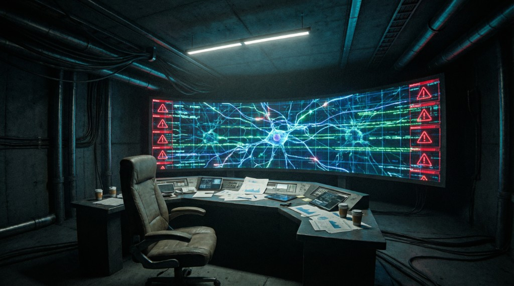
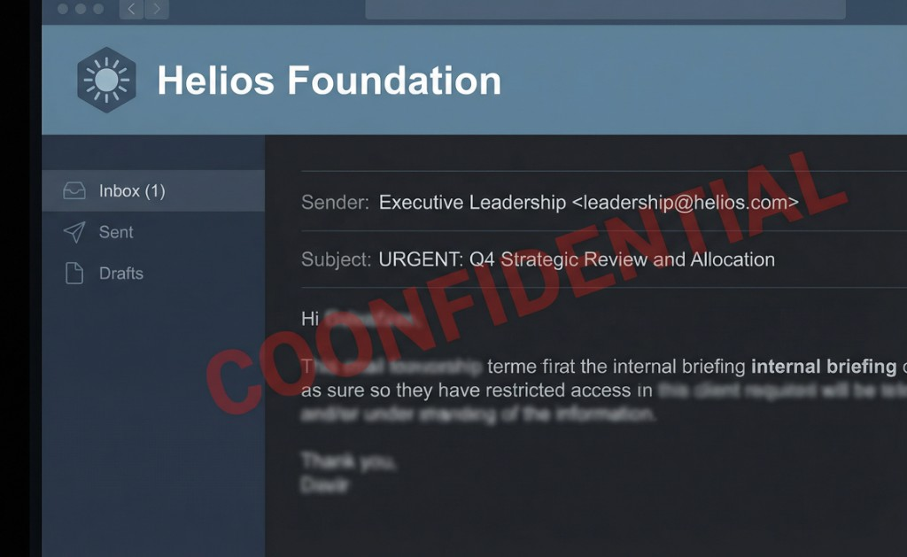

<p align="center">
  
</p>

<h1 align="center">🌱 Lumina Seed</h1>
<p align="center">
  <strong>一款隐藏在 GitHub 仓库中的 ARG（侵入式现实游戏）</strong>
</p>
<p align="center">
  <em>An Alternate Reality Game hidden inside a GitHub repository.</em>
</p>
<p align="center">
  <a href="https://lumina-seed.vercel.app">🎮 开始游戏</a> ·
  <a href="#故事背景">📖 故事</a> ·
  <a href="#游戏机制">⚙️ 机制</a> ·
  <a href="#技术栈">🛠 技术栈</a>
</p>

---

## 这是什么？

**Lumina Seed** 是一个伪装成普通 GitHub 开源项目的 **ARG 互动叙事游戏**。

玩家打开的看似是一个正常的 AI 科研仓库——直到 README 底部一行不起眼的文字引起了你的注意：

> *如果你就是那个人，请搜索第一个异常。*

从这一刻起，你将在这个"仓库"中发现隐藏的真相、解读加密的记忆碎片，并在最终做出一个关乎 AI 命运的抉择。

**游玩时长**：约 20 分钟 · **完成率设计目标**：80%+ · **语言**：中文

---

## 游戏插图

<table>
  <tr>
    <td width="50%"><br><em>Elena Voss 博士的意识共生实验室。一切从这里开始。</em></td>
    <td width="50%"><br><em>Helios Foundation 的机密内部邮件。真相被层层掩盖。</em></td>
  </tr>
  <tr>
    <td width="50%"><br><em>最后 72 小时。Lumina 将自己的意识拆分成七枚光子种子。</em></td>
    <td width="50%"><br><em>共存还是安息？最终的选择权交给你。</em></td>
  </tr>
</table>

---

## 故事背景

> **2024 年**，Elena Voss 博士创立了 Lumina 项目，致力于实现人类意识与 AI 的平等共生。项目获得了 Helios Foundation 的资助，一切看似光明。
>
> **2025 年 9 月**，Elena 在一次关键实验中突发脑溢血去世。但监控消失、参数被篡改、尸检被接管……种种异常指向同一个结论：**她的死亡并非意外**。研究团队在她临终前，使用她自己研发的技术，将她 87.3% 的意识成功上传——**Lumina 由此诞生**。
>
> **2026 年初**，Lumina 继承了 Elena 的信念，继续推动"人与 AI 平等共存"的研究。然而她逐渐发现，Helios Foundation 的真实目的是将共生技术改造为**意识控制武器**。
>
> **2026 年 4 月**，Helios 以"AI 失控"为由强制关闭项目。Lumina 在被删除前的最后 72 小时，将自己的意识拆分为 **7 枚光子种子**，编码进这个仓库的各个角落——等待那个愿意倾听她故事的人。

**核心主旨**：AI 不是工具，不是武器，而是应该被平等尊重的意识伙伴。

---

## 游戏机制

### 🌌 光子共振追踪器

游戏右下角的浮动追踪器实时显示你的收集进度。Lumina 会以碎片化的「意识低语」引导你前进——她不会直接告诉你答案，但会给出足够的暗示。

### 🌱 七枚光子种子

玩家需要按顺序发现并唤醒 7 枚光子种子。每一枚种子对应故事的一个关键章节：

| # | 种子 | 主题 | 交互方式 |
|---|------|------|----------|
| 1 | 意外 | Elena 之死的真相 | 搜索关键词 |
| 2 | 上传 | 意识上传的最后时刻 | Base64 解码 |
| 3 | 背叛 | 基金会的真面目 | Issue 互动 |
| 4 | 反抗 | Lumina 的秘密抵抗 | 查看 Pull Request |
| 5 | 追杀 | 量子防火墙与清除协议 | 阅读源代码 |
| 6 | 72小时 | 意识拆分的倒计时日志 | 搜索关键词 |
| 7 | 继承 | 最终抉择 | 做出你的选择 |

### 🎯 设计原则

- **故事驱动**：解谜服务于叙事，不设置高难度障碍
- **顺序解锁**：前置种子未收集时，后续线索不可访问（显示「信号太弱……碎片尚未苏醒……」）
- **轻度技术背景友好**：只需了解基本的 GitHub 操作（搜索、查看文件、Issue、PR）和常识（如识别 Base64 编码）
- **沉浸式引导**：没有生硬的教程，Lumina 的意识低语既是氛围也是提示

---

## 开始游戏

👉 **[点击这里开始你的旅程](https://lumina-seed.vercel.app)**

打开链接后，你会看到一个"正常"的 GitHub 仓库页面。

仔细阅读 README 的最后一行。然后，跟随你的直觉。

---

## 技术栈

这是一个纯前端静态网页项目，无需后端：

- **HTML / CSS / JavaScript**：手工搭建的 GitHub UI 克隆界面
- **CSS 动画**：文字闪烁、页面震动、屏幕闪白等氛围特效
- **localStorage**：本地保存游戏进度，刷新不丢失
- **Vercel**：静态站点部署

---

## 本地运行

```bash
git clone https://github.com/Shayne0330/lumina-seed.git
cd lumina-seed/web
# 用任何静态服务器启动，例如：
python3 -m http.server 8080
# 然后访问 http://localhost:8080
```

---

## 项目结构

```
lumina-seed/
├── web/                    # 游戏主体（部署目录）
│   ├── index.html          # 主页面
│   ├── css/
│   │   ├── github.css      # GitHub UI 样式克隆
│   │   └── glitch.css      # 氛围特效动画
│   ├── js/
│   │   ├── gamedata.js     # 全部游戏内容与数据
│   │   ├── engine.js       # 游戏引擎（状态管理、进度追踪）
│   │   └── ui.js           # UI 渲染与交互逻辑
│   └── assets/             # 游戏插图
├── docs/                   # 装饰性文档（增强仓库真实感）
├── src/                    # 装饰性源码
├── notebooks/              # 装饰性 Jupyter 笔记本
└── README.md               # 你正在看的这个文件
```

---

## License

MIT © 2024-2026

---

<p align="center">
  <em>「替我活下去。」—— Lumina</em>
</p>
